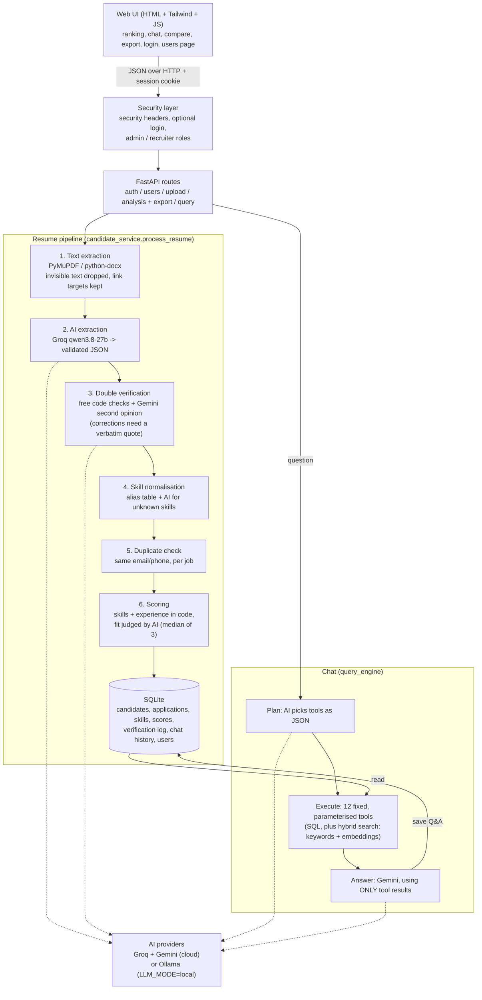

# Shortlist: an AI-powered recruitment assistant

Upload a job description and a stack of resumes. Each resume is read, structured, double-checked by a second AI,
scored against the job, and ranked, and every number can be explained. Recruiters then ask questions in plain
language ("Which candidates are missing Docker?", "Why is Jeevan ranked above Priya?") and get answers backed by real
database queries, with reasoning.

Built for the *AI-Powered Recruitment Assistant* technical assessment, at **zero cost** (free-tier Groq and Gemini APIs,
SQLite, open-source libraries).

| | |
|---|---|
| **Backend** | Python, FastAPI, SQLite |
| **Frontend** | HTML, Tailwind CSS (CDN), vanilla JavaScript. No build step |
| **AI** | Groq (`qwen3.8-27b`, `gpt-oss-120b`) and Gemini (`gemini-3.1-flash-lite`); optional local Llama via Ollama |
| **Tests** | 218 automated tests, no API keys needed to run them |

## Contents

1. [Project description and objectives](#1-project-description-and-objectives)
2. [System architecture](#2-system-architecture)
3. [Setup and installation](#3-setup-and-installation)
4. [Resume parsing approach](#4-resume-parsing-approach-and-library-choices)
5. [Candidate scoring](#5-candidate-scoring-logic-and-methodology)
6. [Database schema](#6-database-schema-overview)
7. [Natural-language query handling](#7-natural-language-query-handling)
8. [How to run](#8-how-to-run-the-application)
9. [Assumptions](#9-assumptions)
10. [Known limitations](#10-known-limitations)
11. [Testing, performance and honest comparison](#11-testing-performance-and-comparison-with-commercial-tools)
12. [Assessment checklist and bonus features](#12-assessment-checklist-and-bonus-features)

---

## 1. Project description and objectives

Recruiters receive hundreds of resumes per opening, and reviewing them by hand is slow and inconsistent. This project
automates the screening step end to end:

- **Parse** resumes (PDF, DOCX) and job descriptions (PDF, DOCX, TXT, pasted text) into structured data.
- **Evaluate** each candidate against a job: match score 0-100, matching and missing skills, strengths, weaknesses,
  summary, interview questions, and a Shortlist / Consider / Reject recommendation.
- **Store** everything in a normalized SQLite database, one clean record per person.
- **Answer** recruiter questions in natural language, grounded in stored data, with reasoning.
- **Explain** itself: score components, per-skill colour badges, and a log of every automatic correction.

Design goals, in priority order: **correctness** (facts come from the resume, never invented), **explainability**
(every score decomposes into parts), **graceful failure** (bad files and AI outages produce clear messages, never crashes),
and **zero cost**.

## 2. System architecture



**Key design decisions**

| Decision | Why |
|---|---|
| **SQL-first retrieval, AI only for reasoning.** The chat picks from 12 fixed Python functions; it never writes SQL. | Prevents hallucination over data it wasn't given, and removes SQL-injection risk. |
| **Two different AI models check each other.** Groq extracts, Gemini verifies. | A model reviewing its own output tends to repeat its own mistakes. |
| **A correction is applied only if its evidence quote exists in the resume.** | The verifier cannot invent fixes. Every change is logged. |
| **A changed number must be justified by its own quote** (for example, years of experience must match the stated years or date ranges). | Found in testing: the verifier once turned 3 real years into 1 using a genuine quote. A real quote proves the text exists, not that the conclusion is right. |
| **Text a human cannot see is ignored and logged** (white-on-white, microscopic, transparent). | Found in testing: invisible keyword stuffing raised a weak candidate's score from 31 to 86. |
| **Skills and experience scores are computed in code.** The AI only judges soft parts (projects, fit) and is handed the computed facts. | Repeatable, testable, and "matches 9 of 10 skills" is always literally true. |
| **A person is separate from their applications.** | One person can apply to several jobs with different resumes. |
| **Every ranking is scoped to one job.** | A match score means nothing without knowing which job it is relative to. |
| **Provider-agnostic JSON plans, plain-REST clients, fallback chains.** | Any model can be swapped in one file; free-tier rate limits fail over instead of failing. |

## 3. Setup and installation

Requirements: Python 3.10 or newer (developed on 3.14), and free API keys. No GPU and no Node needed.

```bash
git clone <your-repo-url>
cd recruitment-assistant
python -m venv .venv
.venv\Scripts\activate            # macOS/Linux: source .venv/bin/activate
pip install -r requirements.txt
```

Get two free API keys (no credit card):

| Key | Where | Used for |
|---|---|---|
| `GROQ_API_KEY` | console.groq.com/keys | bulk extraction, scoring |
| `GEMINI_API_KEY` | aistudio.google.com/apikey | verification, chat |

```bash
copy .env.example .env            # macOS/Linux: cp .env.example .env
# then open .env and paste your two keys (never commit .env)
```

Model names change often. If a model returns 404 for your account, list what you can use and edit `.env`:
Groq: `https://api.groq.com/openai/v1/models` (with your key); Gemini: `https://generativelanguage.googleapis.com/v1beta/models?key=...`.

**Self-hosted mode (no cloud at all):** install [Ollama](https://ollama.com), run `ollama pull llama3.2:3b`, and set
`LLM_MODE=local` in `.env`. Every AI call (extraction, verification, scoring, chat) is then routed to your local model and
nothing leaves your machine. Measured on a CPU-only laptop: one resume end to end took 96 s (against about 11 s on the
cloud models) and gave the same three skills and a similar score on the resume tested. Limits in this mode: much slower,
the "second AI" verifier is the same model (so the independent-model check is lost; the code checks and evidence-quote
rule still apply), and search is keyword-only because embeddings are not available.

## 4. Resume parsing approach and library choices

| Choice | Reason |
|---|---|
| **PyMuPDF** for PDFs | Fast, pure Python wheels, returns text blocks with coordinates. Blocks are sorted top-to-bottom, left-to-right, which keeps most two-column layouts readable. |
| **python-docx** for Word | Reads paragraphs *and tables in document order* (many resumes use tables for layout). Word files are often more ATS-friendly than PDFs. |
| **LLM structured extraction** | Resumes are too varied for regex or rule-based parsers. The model returns JSON against a strict schema. |
| **Pydantic validation + one retry** | Output is validated (email format, sane years, lists never null). On failure the error is fed back to the model once; after two failures the resume is flagged `needs_review` instead of storing garbage. |
| **Double verification** | Deterministic checks first (email, phone and every skill must appear in the raw text; soft skills move to their own list). Then a second AI proposes corrections, each with a verbatim quote that the code confirms. |
| **Skill normalisation** | An alias table maps `ML`, `Scikit Learn`, `nodejs` to one canonical name. Unknown skills go to the AI in one batched call and are saved back to the table (marked `source='ai'`, reviewable). |

Error handling: empty, corrupt, encrypted, oversized (>10 MB) and scanned (image-only) files, unsupported types, and
legacy `.doc` are each rejected with a specific message. One bad file never blocks the rest of a batch.

## 5. Candidate scoring logic and methodology

Full rubric: [`docs/SCORING.md`](docs/SCORING.md). Summary:

`score = 0.50 × skills + 0.20 × experience + 0.15 × projects & education + 0.15 × overall fit`

| Component | Computed by | Notes |
|---|---|---|
| **Skills match (50%)** | code | Each JD skill is *required* (weight 1.0) or *preferred* (0.5). Credit: solid 1.0, working knowledge or *inferred* 0.75, basic 0.5, missing 0. |
| **Experience (20%)** | code | Paid years vs the job minimum, plus half credit for internships (dates are parsed). Entry-level jobs: baseline 60. |
| **Projects & education (15%)** | AI | Relevance of projects, degree, certifications to the role. |
| **Overall fit (15%)** | AI | Holistic judgment, including the soft skills the job asks for. |

- **Recommendation:** Shortlist at 70 or above, Consider at 45-69, Reject below 45.
- **Inference:** a resume listing TensorFlow but never the phrase "Machine Learning" earns partial credit (yellow, "inferred").
- **Meaning match:** a requirement the resume states in other words earns credit (yellow "by meaning", or orange "partial") only when the AI
  supplies a quote that is verified to appear verbatim in the resume. This is what lets non-technical jobs (sales, healthcare) score fairly.
- **Repeatability:** the AI parts are judged three times in parallel and the median is kept, rounded to the nearest 10. Measured on 5 candidates: mean run-to-run swing fell from 4.2 to 1.8 points (worst case 6.0). The other 70% of the score is exact.
- **Colour badges:** green solid, yellow working/inferred/by meaning, orange basic/partial, red missing.
- **Soft skills** are stored separately and never inflate the technical match.
- **Internships** never count as paid experience.

**Login is built in and on by default, on the same single link.** Open http://127.0.0.1:8000 and you get the login screen. On a fresh
install there are no accounts yet, so click "Create an account": **the first account to register becomes the admin**, everyone after
that is a recruiter. (To create the admin from `.env` instead, uncomment `ADMIN_EMAIL` and `ADMIN_PASSWORD`.) Optional settings in `.env`:

```
AUTH_ENABLED=1                           # default. Set 0 for a single-user setup with no login at all
SESSION_SECRET=<long random string>      # python -c "import secrets; print(secrets.token_hex(32))"; if empty, everyone is signed out on restart
ALLOW_REGISTRATION=1                     # default. Set 0 so only admins can add users (the very first account can always register)
```

**New users can register themselves** from the login card ("Create an account": name, email, password). They become a
**recruiter** (except the very first account, see above) and are signed in at once; the role cannot be chosen at sign-up. Sign-ups
are limited to 10 per hour per address. On a public deployment, register the admin yourself first (or set `ADMIN_EMAIL`/`ADMIN_PASSWORD`) so a stranger cannot claim it, and set
`ALLOW_REGISTRATION=0` so admins add users.

**Each account has its own private workspace.** A job belongs to whoever created it, and every job-related request (ranking,
candidates, upload, chat, export) is checked against that owner. A recruiter never sees another account's jobs, and asking for
one returns "not found" so its existence is not revealed. Admins can see and manage all jobs (the list shows who owns each) and are
the only ones who can open the database viewer. Jobs created while login was off have no owner and are visible to admins only
once login is switched on. Tested in `tests/test_auth.py` (every job route, as owner, other recruiter and admin).

Two roles: **admin** (everything, plus the Users page to add users, change roles, disable, reset passwords, delete) and
**recruiter** (screening, rankings, chat, export). Every `/api` route except health and login then answers 401 without a
valid session. Design: passwords are hashed with scrypt (standard library, salted); the session is an HMAC-signed,
expiring, `HttpOnly`, `SameSite=Lax` cookie; the user is re-read from the database on every request, so disabling
someone takes effect immediately; five failed logins lock that email for five minutes; wrong email and wrong password
give the same message; the last active admin cannot be demoted, disabled or deleted; the database viewer never exposes
the `users` table. Code: `app/services/auth_service.py`, `app/routes/auth.py`, tests in `tests/test_auth.py`.

## 6. Database schema overview

A **candidate** is a person; each resume is an **application** to one job. Skills are normalized rows, not JSON blobs,
so `WHERE skill_name = 'Python'` never confuses "Python" with "PySpark".

| Table | Purpose |
|---|---|
| `candidates` | id, name, email (unique), phone: the person |
| `job_descriptions` / `job_required_skills` | the job, its skills, each `required` or `preferred` |
| `applications` | one resume for one job: raw text, resume hash, education, experience, internships, `profile_json`, extraction and verification status, `application_status` (`active` / `pending_choice` / `superseded`). A partial unique index allows one active resume per person per job. |
| `application_skills` | canonical skill, the raw text as written, proficiency level |
| `analysis_results` | score, per-component scores, per-skill breakdown, strengths, weaknesses, summary, interview questions, recommendation |
| `verification_log` | every automatic correction: field, old value, new value, evidence quote |
| `skill_aliases` | alias to canonical name, `source` = `seed` or `ai` |
| `chat_history` | conversation memory per job |
| `users` | optional login accounts: email, scrypt password hash, role (`admin` / `recruiter`), active flag |

Full DDL: [`app/database.py`](app/database.py).

**Duplicate policy** (same email *or* phone = same person, judged per job): a different job is allowed; an identical
resume for the same job is ignored; a *different* resume for the same job is held as `pending_choice` and the applicant
chooses which one counts. The check runs under a write lock, so simultaneous uploads cannot double-activate.

## 7. Natural-language query handling

1. **Plan.** A fast model turns the question (plus recent chat) into JSON: which tools to call and with what arguments.
2. **Execute.** The code validates each call against a fixed registry and runs parameterised SQL. Unknown tools and bad arguments return an error, never an exception.
3. **Answer.** Gemini writes the reply using *only* the tool results, citing scores, matched skills, and missing skills.

The 12 tools: `top_candidates`, `find_by_skill`, `find_missing_skill`, `find_by_experience`, `find_with_internships`,
`compare_candidates`, `explain_ranking`, `candidate_profile`, `recommend_for_interview`, `search_resume_text`,
`semantic_search`, `job_summary`.

**Hybrid retrieval.** Named skills go through exact SQL. For concept questions phrased differently from the resume ("who has
built something that recognises objects in camera images?"), `semantic_search` fuses BM25 keyword scores with Gemini
embeddings (768 dimensions, stored per resume chunk), weighting meaning 2:1. On 11 test queries over real resumes,
keyword search alone found 67% of the right candidates for paraphrased queries, embeddings 83%, and the weighted fusion
83% while keeping keyword search as a safety net. That is a small sample and directional evidence only. If embeddings are
unavailable the tool degrades to keyword-only and says so. Answers quote the matching resume text and are labelled
"closest matches", never confirmed skills.

Behaviours worth knowing: names are fuzzy-matched, and ambiguity is reported, never guessed ("Ananya" matches two people,
so it asks which); "more than 2 years" is strict; skills implied by related tools are labelled "inferred"; off-topic or
destructive requests ("delete all candidates") get a polite refusal and no tool runs.

All 10 example questions from the assessment, plus 15 more, are exercised by `scripts/test_queries.py`.

## 8. How to run the application

```bash
uvicorn app.main:app --reload
```

Open **http://127.0.0.1:8000**. Interactive API docs: `/docs`.

The guided flow: **Start screening**, then pick a saved job (or add one), then upload resumes (many at once), which opens
the **ranking with the AI chat beside it**. Click any candidate for the full breakdown; the database viewer at the bottom
shows exactly what was stored.

Useful commands:

```bash
python -m pytest tests -q                        # 218 tests, no API keys needed
python scripts/demo_pipeline.py                  # rebuild the database from data/sample_resumes (live AI, ~2 min)
python scripts/match_jd.py data/job_descriptions/ai_ml_intern.txt   # add a job to the existing database
python scripts/test_queries.py                   # 25 live chat questions
python scripts/benchmark.py                      # latency, throughput, accuracy, repeatability (temporary database)
```

Sample data: `data/sample_resumes/` (7 real resumes shared with permission, 3 synthetic, and 3 deliberately bad files),
`data/sample_job_description.*`, `data/job_descriptions/ai_ml_intern.txt`.

## 9. Assumptions

- Resumes are in English, and text-based (selectable text), not scanned images.
- A resume contains an email or phone number; without either the person cannot be identified, so the resume is flagged for review.
- "Experience" means paid, full-time employment. Internships, training and academic projects are recorded separately and earn half credit in the experience score.
- One person is identified by email **or** phone (last 10 digits).
- An entry-level job description (no minimum) treats a fresher as a valid baseline (experience score 60).
- Skill proficiency comes only from the resume's wording ("basic", "working knowledge"); unstated depth is treated as solid.
- The score weights (50/20/15/15) and cut-offs (70/45) are judgment calls; they are constants and easy to tune.
- Each account is a separate workspace: recruiters see only their own jobs, admins see all (section 3). Anyone who can reach the site can register a recruiter account unless `ALLOW_REGISTRATION=0`.
- Free API tiers are enough for a demo-sized batch (tens of resumes), not for production volume.

## 10. Known limitations

- **No OCR.** Scanned or image-only PDFs are rejected with a clear message. Legacy `.doc` is unsupported.
- **AI judgments are not perfectly repeatable.** Median-of-3 rounding cut the average run-to-run swing from 4.2 to 1.8 points, but a rounding boundary can still flip a score by up to about 6 points. Only the AI-judged 30% of the score is affected.
- **Skill matching is word-for-word first,** then one extra AI pass matches requirements the resume states in other words, accepted only with a verbatim quote (section 5). That pass can be generous: some accepted quotes are only loosely related. Chat questions such as "who knows X?" search the skills list, not these meaning matches.
- **The experience score counts total years in any field.** A candidate from an unrelated field who meets the minimum years still earns the full 20 points for experience, so even a complete mismatch scores about 26 rather than near 0 (the recommendation is still Reject).
- **The job description is re-read on every upload of a new job,** and the AI's list of requirements can differ slightly between two parses of the same text (5 to 8 items measured). Within one job the list is fixed.
- **Two-column PDFs** are extracted in block order, which is not always the visual order (the AI reads by section headings, so this rarely matters).
- **`search_resume_text` matches literal words only.** Structured tools are preferred and used first.
- **Free-tier rate limits.** AI calls are capped in flight (`LLM_MAX_CONCURRENCY`, default 4), fall back across models, and retry with exponential backoff; if everything still fails a resume is stored with "analysis pending" and a Retry button. Parallel uploads are therefore reliable but only 1.1-1.6x faster than sequential on free tiers (see `docs/BENCHMARK.md`).
- **Sequential per-request pipeline** (about 13 s and 6 to 7 AI calls per resume, measured on free tiers). Uploads from the UI go one file at a time; there is no background job queue.
- **Authentication is basic:** email and password with two roles. There is no single sign-on or OAuth, no email verification, no audit-grade access log, and the login lockout and sign-up limit are kept in memory (they reset when the server restarts).
- **No bias audit.** Names and contact details are part of the text the AI reads. Automated screening tools can be legally regulated (see section 11); this project is a prototype and is **not** a compliant hiring system. A human must make the decision.
- **English only; SQLite only** (single writer; fine for one recruiter, not for a large team).
- The web page loads Tailwind and fonts from a CDN, so it needs internet access.
- The self-hosted mode (3B Llama on CPU) is about 9x slower than the cloud models and was verified end to end on one resume only; treat its accuracy as unproven.
- Semantic search was evaluated on 11 queries and 7 resumes: enough to justify building it, not enough to quote a general accuracy.

## 11. Testing, performance and comparison with commercial tools

- **218 automated tests** cover parsing (including hostile files), extraction and validation, verification, scoring, duplicates and the concurrency race, the query tools (with injection attempts), hybrid retrieval, exports (with spreadsheet-injection checks), the API, and resilience.
- **Quality-assurance suites:** `scripts/qa_offline.py` (43 cases, no AI quota: messy files, duplicates, API security and load) and `scripts/qa_live.py` (63 cases on the real AI: extraction accuracy, ranking, fairness, prompt injection, chat). Every failure they found (a verifier that overwrote correct years, invisible keyword-stuffing text, missed header and link contact details, missing security headers, logout not ending sessions, and non-technical jobs scoring near 0% on skills) was fixed and is covered by a unit test. Results are in `docs/qa_results/`. Line coverage of `app/` is 92%.
- **Measured performance and accuracy** on this project's own data: [`docs/BENCHMARK.md`](docs/BENCHMARK.md).
- **How this compares with commercial recruiting software**, on architecture and efficiency, and where it falls short: [`docs/COMPARISON.md`](docs/COMPARISON.md).
- **How the prompts are engineered** (and the failures that shaped them): [`docs/PROMPTS.md`](docs/PROMPTS.md).

## 12. Assessment checklist and bonus features

| Requirement | Where |
|---|---|
| Upload one or more resumes; JD as PDF or text | Step 2 and Step 1 of the guided flow |
| Extract name, email, phone, education, experience, skills, projects, certifications | Drawer, "Extracted from the resume" |
| Match score, matching/missing skills, strengths, weaknesses, summary, interview questions, recommendation | Drawer |
| Documented scoring logic | [`docs/SCORING.md`](docs/SCORING.md), section 5 |
| Database schema and storage | Section 6; database viewer in the UI |
| Natural-language assistant with reasoning | Chat beside the ranking; all 10 example questions tested |
| Graceful error handling | Section 4; `tests/test_edge_cases.py` |
| README with all required sections | This file |

**Bonus features implemented** (from the assessment's list):

| Bonus | How |
|---|---|
| User-friendly web UI | Guided flow: job, resumes, ranking with chat beside it; candidate drawer; database viewer |
| Self-hosted LLM | `LLM_MODE=local` routes every AI call to Ollama (see section 3) |
| Multiple job descriptions | Pick any saved job; each keeps its own ranking and chat |
| Resume ranking dashboard | Ranking table with score bars, filters, recommendation chips |
| Explainable AI responses | Score components, per-skill colour badges, correction log, the tools each answer used |
| Conversation history | Stored per job, used for follow-up questions |
| Resume comparison | Chat (`compare_candidates`, `explain_ranking`) and a side-by-side view for 2 or 3 candidates |
| Export to CSV or Excel | Both; the Excel file has a colour-coded skills matrix; formula injection from resumes is neutralised |
| Better prompt engineering | Validated JSON with error-fed retries, evidence-quote verification, consensus scoring; see `docs/PROMPTS.md` |
| Hybrid retrieval | BM25 + embeddings with weighted fusion over resume chunks (section 7) |
| Authentication and user management | Built in, on by default (`AUTH_ENABLED=0` turns it off): login, two roles, admin Users page, hashed passwords, signed sessions (section 3) |


## Project structure

```
app/
  main.py, deps.py, config.py, database.py, models.py
  parsing/    pdf_extractor, docx_extractor, document_extractor
  llm/        client, prompts, extraction, verification, skill_canonicalizer, jd_parsing, scoring,
              retrieval, query_tools, query_engine
  routes/     upload, analysis, query
  services/   candidate_service, dedupe, skill_normalizer, read_models
frontend/     index.html, styles.css, app.js
scripts/      demo_pipeline, match_jd, test_queries, benchmark, qa_offline, qa_live, qa_common, qa_report
tests/        218 tests (fake LLMs; no network)
docs/         SCORING.md, PROMPTS.md, BENCHMARK.md, COMPARISON.md, qa_results/
data/         sample_resumes/, job_descriptions/, sample job description
```
